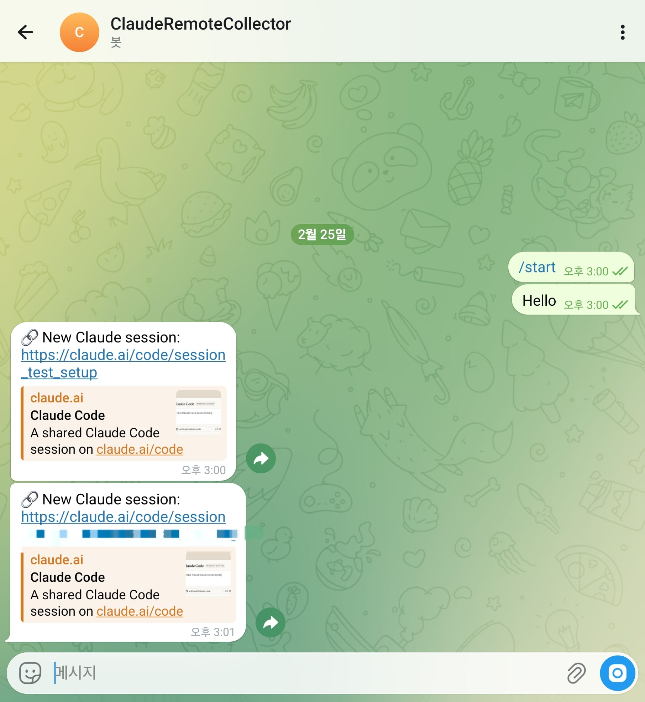
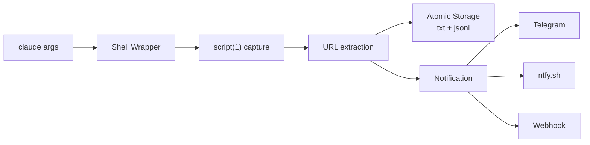

# claude-remote-collector

**Never copy-paste a Claude session URL again.**

[](https://www.python.org/)
[](LICENSE)
[](tests/)
[](#zero-dependencies)

<p align="center">
  
</p>

## Why?

You start a Claude Code remote session on your server. The session URL flashes in the terminal. Now you need it on your phone — but you've already switched windows, or the terminal scrolled, or you just weren't looking.

**claude-remote-collector** captures every remote session URL the moment it appears and sends it straight to your phone. No manual copying. No missed links.

## Features

- **Transparent capture** — Shell wrapper intercepts `claude` seamlessly; your workflow stays the same
- **Instant mobile push** — Telegram, [ntfy.sh](https://ntfy.sh), or any webhook (Discord, Slack, n8n, Zapier)
- **Multi-shell** — Fish, Bash, and Zsh with identical behavior
- **Dual capture strategy** — Grabs URLs on startup (real-time) with exit fallback for reliability
- **Atomic storage** — Dual-format (text + JSONL) with `fcntl` file locking for safe concurrent access
- **Interactive wizards** — `setup telegram` walks you through everything, no config file editing
- **Zero dependencies** — Pure Python stdlib. Nothing to break, nothing to audit

## How It Works



The shell wrapper shadows your `claude` command. It runs Claude Code inside `script(1)` to capture terminal output, extracts the session URL via regex, stores it with atomic file locking, and fires your notification — all transparently.

## Prerequisites

Claude Code must have remote control enabled. Run `/config` inside Claude Code and set **"Enable Remote Control for all sessions"** to `true`.

## Quick Start

```bash
# 1. Install
git clone https://github.com/Axect/claude-remote-collector.git
cd claude-remote-collector && uv sync
uv tool install -e .

# 2. Set up shell wrapper
claude-remote-collector install fish   # or bash, zsh, all

# 3. Set up notifications (optional)
claude-remote-collector setup telegram
```

That's it. Now just use `claude` as you always do.

<details>
<summary><b>Manual installation (without CLI)</b></summary>

```bash
# Fish — copy function file
cp scripts/claude-wrapper.fish ~/.config/fish/functions/claude.fish

# Bash — source in .bashrc
echo 'source "/path/to/scripts/claude-wrapper.bash"  # claude-remote-collector' >> ~/.bashrc

# Zsh — source in .zshrc
echo 'source "/path/to/scripts/claude-wrapper.zsh"  # claude-remote-collector' >> ~/.zshrc
```

</details>

## Notification Setup

### Telegram (recommended)

```bash
claude-remote-collector setup telegram
```

The wizard will:
1. Ask for your bot token (create one via [@BotFather](https://t.me/BotFather))
2. Auto-detect your chat ID (just send a message to the bot)
3. Send a test message to confirm
4. Enable auto-notify

### ntfy.sh (push notifications)

```bash
claude-remote-collector setup ntfy
```

Uses [ntfy.sh](https://ntfy.sh) for simple push notifications. Install the ntfy app on your phone and subscribe to your chosen topic.

### Webhook (generic)

```bash
claude-remote-collector setup webhook
```

POSTs a JSON payload to any URL. Works with Discord webhooks, n8n, Zapier, or custom services.

### Manual notification

```bash
# Send the latest session link now
claude-remote-collector notify

# Send a specific URL
claude-remote-collector notify --url "https://claude.ai/code/session_..."
```

## CLI Commands

```bash
claude-remote-collector status              # Check installation and session count
claude-remote-collector list                # List all collected sessions
claude-remote-collector list -n 5           # Last 5 entries
claude-remote-collector list --json         # JSONL output for scripting
claude-remote-collector latest              # Most recent session
claude-remote-collector latest --url-only   # Just the URL
claude-remote-collector tail                # Watch for new sessions in real time
claude-remote-collector clean --keep 20     # Delete old entries, keep last 20
claude-remote-collector path                # Storage file path
```

### Configuration

```bash
claude-remote-collector config show                       # View all settings
claude-remote-collector config get notify.backend         # Get a value
claude-remote-collector config set notify.auto_notify true # Set a value
claude-remote-collector config path                       # ~/.claude-remote-sessions/config.toml
```

## Trust & Transparency

### Zero Dependencies

This project uses **only the Python standard library** — no pip packages, no supply chain risk. What you see in the source is what runs on your machine.

### What the Shell Wrapper Does

The wrapper is a thin function that shadows `claude`. Here's the core logic:

<details>
<summary>View wrapper code (Fish)</summary>

```fish
function claude --wraps=claude
    set -l tmpfile (mktemp /tmp/claude-capture.XXXXXX)

    # Background watcher: polls for URL in captured output (up to 60s)
    command sh -c '...' _ $tmpfile </dev/null >/dev/null 2>/dev/null &

    # Run claude inside script(1) to capture terminal output
    command script -qf -c "command claude $argv" $tmpfile
    set -l exit_code $status

    # Record URL if found (startup capture or exit fallback)
    # ...
    rm -f $tmpfile
    return $exit_code
end
```

</details>

If `claude-remote-collector` is uninstalled or fails, the wrapper falls through to the real `claude` command. Your workflow is never blocked.

### Privacy

Your session data stays on your machine in `~/.claude-remote-sessions/`. URLs are **only** sent externally when you explicitly configure a notification backend. No telemetry, no third-party servers, no surprises.

## Storage Format

Sessions are stored in `~/.claude-remote-sessions/`:

**sessions.txt** — human-readable, one per line:
```
2026-02-25T12:00:00Z https://claude.ai/code/session_01XNYXVWynq7cb6rsR4inaM3
```

**sessions.jsonl** — structured, for scripting:
```json
{"timestamp":"2026-02-25T12:00:00Z","session_id":"01XNYXVWynq7cb6rsR4inaM3","url":"https://claude.ai/code/session_01XNYXVWynq7cb6rsR4inaM3","cwd":"/home/user/project","source":"startup"}
```

<details>
<summary><b>Power-user tip: query with jq</b></summary>

```bash
# Last 5 sessions
tail -5 ~/.claude-remote-sessions/sessions.jsonl | jq .

# All sessions from today
cat ~/.claude-remote-sessions/sessions.jsonl | jq -r 'select(.timestamp | startswith("2026-02-25"))'

# Session count by source
cat ~/.claude-remote-sessions/sessions.jsonl | jq -r '.source' | sort | uniq -c
```

</details>

## Extending

Adding a new notification backend is straightforward — implement two methods:

```python
from collector.notifier import Notifier, NotifyResult
from collector.storage import SessionEntry

class SlackNotifier(Notifier):
    name = "slack"

    def send(self, entry: SessionEntry) -> NotifyResult:
        # Your notification logic here
        ...

    @classmethod
    def from_config(cls, config: dict) -> "SlackNotifier":
        ...
```

PRs for new backends (Slack, Discord, Matrix, etc.) are welcome!

<details>
<summary><b>Troubleshooting</b></summary>

**Wrapper not loading after install?**
- Restart your shell or run `source ~/.bashrc` / `source ~/.zshrc`
- For Fish: `source ~/.config/fish/functions/claude.fish`

**Notifications not firing?**
- Check config: `claude-remote-collector config show`
- Verify `notify.enabled = true` and `notify.auto_notify = true`
- Test manually: `claude-remote-collector notify`

**URL not captured?**
- Ensure Claude Code is started with `--remote` flag
- Check that `script` command is available on your system
- Run `claude-remote-collector status` to verify installation

**PATH conflict with multiple claude commands?**
- The wrapper calls `command claude` to bypass itself and invoke the real binary
- If issues persist, check `which -a claude` to see all candidates

</details>

## Uninstall

```bash
# Remove shell wrapper
claude-remote-collector uninstall fish   # or bash, zsh, all

# (Optional) Remove collected data and config
rm -rf ~/.claude-remote-sessions
```

## Development

```bash
uv sync
uv run pytest tests/ -v    # 46 tests
```

## Project Structure

```
claude-remote-collector/
├── pyproject.toml
├── src/collector/
│   ├── cli.py              # CLI entry point
│   ├── capture.py          # URL pattern matching
│   ├── storage.py          # Dual-file storage with atomic fcntl locking
│   ├── config.py           # TOML config management
│   ├── notifier.py         # Pluggable notifier base + factory
│   ├── setup.py            # Interactive setup wizards
│   ├── wrapper.py          # Shell wrapper install/uninstall/status
│   └── notifiers/
│       ├── telegram.py     # Telegram Bot API
│       ├── webhook.py      # Generic HTTP webhook
│       └── ntfy.py         # ntfy.sh push notifications
├── scripts/
│   ├── claude-wrapper.fish
│   ├── claude-wrapper.bash
│   └── claude-wrapper.zsh
└── tests/                  # 46 tests covering all modules
```

## License

MIT
